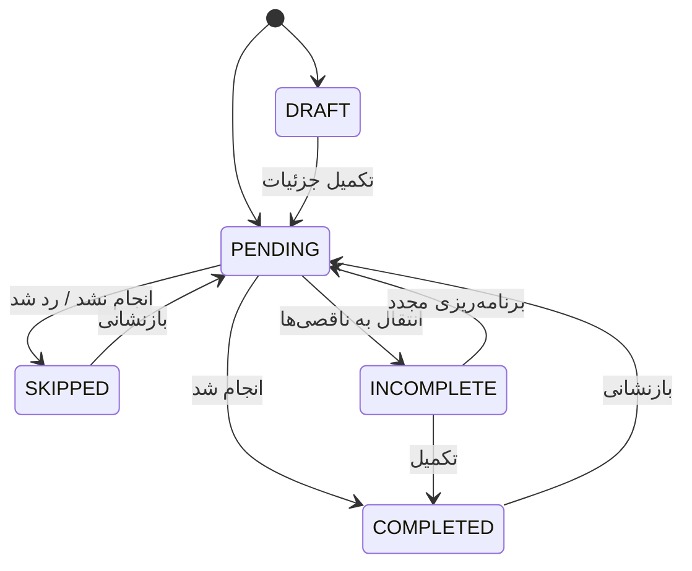

# سند جامع اصلاحات تسک و گزارش‌گیری

> وضعیت این سند: قرارداد اجرایی پروژه
>
> این فایل فقط برنامه اصلاحات، تصمیم‌های محصولی، قرارداد داده، ترتیب اجرا و معیارهای پذیرش را مشخص می‌کند. ایجاد این فایل به‌تنهایی نباید هیچ تغییری در کد، اسکما، migration یا API ایجاد کند.

## ۰. دستورالعمل استفاده برای ایجنت‌ها

این سند مرجع اصلی اصلاحات زیر است:

- ساخت و lifecycle تسک‌ها
- پیش‌نویس‌ها و ناقصی‌ها
- برنامه هفتگی
- نوع فعالیت «کلاس/ویدیو»
- گزارش دانش‌آموز
- گزارش مشاور
- داشبورد آماری

هر ایجنت باید:

1. پیش از تغییر، فقط scope اختصاص‌داده‌شده را بررسی کند.
2. قراردادهای این سند را عیناً رعایت کند.
3. خارج از scope خود refactor نکند.
4. بدون نیاز واقعی، API backward compatibility یا مدل موازی اضافه نکند.
5. داده فاقد مقدار را با صفر، مقدار خنثی یا مقدار ساختگی جایگزین نکند.
6. در صورت مشاهده تصمیم مبهم، حدس محصولی نزند و آن را در گزارش پایان کار ثبت کند.
7. پس از تغییر، typecheck، تست مرتبط و بررسی diff را انجام دهد.
8. در پایان، فایل‌های تغییرکرده، تست‌های اجراشده و موارد باقی‌مانده را گزارش کند.

### وضعیت اجرای مراحل

- [x] مرحله ۱: حذف کامل AI
- [x] مرحله ۲: اضافه‌کردن نوع فعالیت «کلاس/ویدیو»
- [ ] مرحله ۳: طراحی و اجرای مدل وضعیت تسک
- [ ] مرحله ۴: migration و پاک‌سازی داده‌های قبلی
- [ ] مرحله ۵: اصلاح API و authorization تسک
- [ ] مرحله ۶: یکسان‌سازی ساخت دستی و ساخت توسط مشاور
- [ ] مرحله ۷: اصلاح برنامه هفتگی و Draftهای چندروزه
- [ ] مرحله ۸: تفکیک Draft و Incomplete در UI
- [ ] مرحله ۹: ساخت سرویس گزارش مشترک
- [ ] مرحله ۱۰: اتصال گزارش مشاور به داده واقعی
- [ ] مرحله ۱۱: حذف تحلیل‌های ساختگی و nullable کردن داده‌های غایب
- [ ] مرحله ۱۲: اصلاح گزارش فصل‌محور و Weekly Goal
- [ ] مرحله ۱۳: تست جامع و build نهایی

---

## ۱. هدف نهایی

سیستم باید این مفاهیم را از هم جدا و enforce کند:

1. **Draft / پیش‌نویس**: فقط نام درس و تاریخ کافی است؛ جزئیات اجرایی هنوز تعیین نشده.
2. **Pending / آماده انجام**: جزئیات اجرایی ثبت شده و تسک آماده اجراست.
3. **Completed / انجام‌شده**: تسک انجام شده و نتیجه واقعی آن قابل گزارش است.
4. **Skipped / ردشده**: کاربر تسک را رد کرده یا آن را انجام نداده است.
5. **Incomplete / ناقصی**: تسک برنامه‌ریزی شده بوده، اما انجام نشده یا بخشی از آن باقی مانده و باید جبران شود.

اصل کلیدی:

```text
Draft با Incomplete یکی نیست.
نبود داده با عملکرد صفر یکی نیست.
Target با Actual یکی نیست.
```

---

## ۲. حذف کامل ساخت تسک با AI

### تصمیم محصولی

قابلیت ساخت تسک و برنامه از طریق AI به‌طور کامل حذف می‌شود.

### محل‌های قابل بررسی

- `src/components/plan/AiEntryModal.tsx`
- `src/app/api/parse-plan/route.ts`
- تمام importها و دکمه‌های بازکردن modal
- command palette، shortcutها و navigationهای مرتبط
- `ParsedTask` و typeهای اختصاصی AI در صورت بی‌استفاده‌شدن
- dependencyها یا utilityهای فقط مربوط به parser

### معیار پذیرش

- هیچ route یا دکمه‌ای برای ساخت تسک با AI در UI باقی نماند.
- هیچ import یا reference بی‌استفاده‌ای به `AiEntryModal` باقی نماند.
- هیچ request کلاینتی به `/api/parse-plan` ارسال نشود.
- حذف AI به ساخت دستی، مشاور و برنامه هفتگی آسیب نزند.
- typecheck و build بدون reference باقی‌مانده به AI موفق باشند.

---

## ۳. نوع فعالیت جدید: کلاس/ویدیو

### قرارداد نوعی

به `ActivityType` مقدار زیر اضافه شود:

```ts
'کلاس/ویدیو'
```

فهرست کامل:

```ts
['مطالعه', 'مرور', 'تست آموزشی', 'تست سنجشی', 'کلاس/ویدیو']
```

### محل‌های لازم برای اصلاح

- `src/lib/types.ts`
- `ManualEntrySheet`
- `TaskDetailsDialog`
- `TaskModal` مشاور
- validationهای create و update و batch
- نمایش badge در `TaskCard`
- `analytics.ts`
- legend و رنگ chartها در `AnalyticsView`
- هر constant یا filter فعالیت

### ذخیره‌سازی

فیلد فعلی Prisma:

```prisma
activityTypes String?
```

فعلاً می‌تواند به‌صورت JSON string باقی بماند:

```json
["کلاس/ویدیو"]
```

### گزارش فعالیت

برای chart یک کلید امن TypeScript استفاده شود:

```ts
کلاس_ویدیو
```

و label نمایشی:

```text
کلاس/ویدیو
```

اگر یک تسک چند فعالیت دارد، تقسیم زمان بین فعالیت‌ها فعلاً تقریبی و مساوی است. این موضوع باید در comment یا مستندات داخلی مشخص باشد.

---

## ۴. مدل ساخت تسک

تمام مسیرهای ساخت، به‌جز تفاوت workflow برنامه هفتگی، باید یک قرارداد مشترک داشته باشند:

- ساخت دستی دانش‌آموز
- ساخت توسط مشاور
- ایجاد Draft در هر روز
- تکمیل Draft
- برنامه هفتگی

### ۴.۱ ساخت کامل

حداقل داده‌های لازم:

- دانش‌آموز
- درس
- حوزه (`کنکور` یا `نهایی`)
- تاریخ
- حداقل یک نوع فعالیت
- زمان هدف بزرگ‌تر از صفر
- تعداد تست هدف صفر یا بیشتر

نتیجه:

```text
status = PENDING
```

فصل، مبحث، حالت مبحثی و صفحات باید اختیاری باقی بمانند، مگر اینکه یک rule مشخص در curriculum نیاز به آن‌ها داشته باشد.

### ۴.۲ ساخت Draft

حداقل داده لازم:

```text
studentId
subjectId
subject
fieldType
date
status = DRAFT
```

موارد زیر برای ایجاد Draft اجباری نیستند:

```text
chapterId
topicId
topicModeId
pageStart
pageEnd
activityTypes
```

حداقل شرط UI:

```ts
const canCreateDraft = Boolean(selection.subjectId && selection.subjectName);
```

پس از تکمیل جزئیات اجرایی، Draft به `PENDING` تبدیل می‌شود.

---

## ۵. Draft عمومی است، نه مخصوص برنامه هفتگی

Draft می‌تواند از این مسیرها ایجاد شود:

1. ساخت دستی برای روز جاری
2. ساخت دستی برای هر تاریخ انتخابی در تقویم
3. ساخت توسط مشاور برای دانش‌آموز
4. برنامه هفتگی
5. هر workflow آینده‌ای که فقط درس و تاریخ را ثبت می‌کند

برنامه هفتگی فقط این قابلیت اضافی را دارد:

1. انتخاب درس برای چند روز مختلف
2. ایجاد Draftهای مستقل برای روزهای مختلف
3. تکمیل جزئیات Draftها در مرحله بعد

ایجاد Draft در یک روز نباید به ایجاد Draft در سایر روزها وابسته باشد.

نمونه معتبر:

```text
شنبه: ریاضی، Draft
یکشنبه: زیست، Draft
دوشنبه: شیمی، تسک کامل
```

---

## ۶. مدل وضعیت تسک

### راه‌حل مطلوب

یک فیلد صریح lifecycle به نام `status` اضافه شود.

مقادیر مجاز:

```text
DRAFT
PENDING
COMPLETED
SKIPPED
INCOMPLETE
```

ترجیحاً Prisma enum استفاده شود؛ اگر migration اولیه نیازمند احتیاط است، ابتدا String با validation محدودشده استفاده شود.

### Mapping داده فعلی

| وضعیت قبلی | وضعیت جدید |
|---|---|
| `detailsCompleted=false`, `completed=null` | `DRAFT` |
| `detailsCompleted=true`, `completed=null` | `PENDING` |
| `detailsCompleted=true`, `completed=true` | `COMPLETED` |
| `detailsCompleted=true`, `completed=false` | `SKIPPED` |
| تسک منتقل‌شده واقعی به ناقصی‌ها | `INCOMPLETE` |

رکوردهای متناقض زیر باید قبل از migration گزارش و تعیین تکلیف شوند:

```text
detailsCompleted=false && completed=true
detailsCompleted=false && completed=false
```

بدون تصمیم مستند، این رکوردها نباید بی‌صدا تبدیل شوند.

### فیلدهای قدیمی

پس از migration و اطمینان از استفاده‌نشدن، `completed` و `detailsCompleted` حذف یا فقط برای migration نگه داشته شوند. نباید دو منبع حقیقت دائمی باقی بماند.

---

## ۷. رفتار Draft و Incomplete

### Draft

```text
اطلاعات برنامه‌ریزی ناقص است.
```

رفتار:

- در تب «پیش‌نویس‌ها» نمایش داده شود.
- در گزارش عملکرد وارد نشود.
- complete یا skip مستقیم نداشته باشد.
- فقط تکمیل جزئیات، تغییر تاریخ و حذف مجاز باشد.

### Incomplete

```text
اطلاعات برنامه‌ریزی کامل است، اما اجرا انجام نشده یا ناقص مانده است.
```

رفتار:

- در تب «ناقصی‌ها» نمایش داده شود.
- targetها حفظ شوند.
- actualهای ثبت‌شده حفظ شوند.
- در آمار completed حساب نشود.
- امکان انتقال به تاریخ جدید و بازگشت به `PENDING` داشته باشد.

### انتقال وضعیت



انتقال تاریخ نباید status را بدون تصمیم صریح lifecycle تغییر دهد.

---

## ۸. اصلاح API و validation

### Create و Batch Create

API باید بر اساس status اعتبارسنجی کند.

برای `DRAFT`:

- فقط subject، student، fieldType و date لازم است.
- activity، target time، target tests و curriculum details اختیاری هستند.
- completion نباید non-null باشد.

برای `PENDING`:

- activity غیرخالی لازم است.
- target time باید عدد بزرگ‌تر از صفر باشد.
- target tests باید عدد صفر یا بیشتر باشد.
- completion باید pending باشد.

برای `COMPLETED`:

- completion واقعی باید true باشد.

برای `SKIPPED`:

- completion واقعی باید false باشد.

برای `INCOMPLETE`:

- completion نباید true یا false مستقل و متناقض باشد.

### PATCH

PATCH عمومی نباید اجازه ساخت state متناقض بدهد. حداقل باید:

- status نهایی را validate کند.
- تغییر به `DRAFT` را فقط برای داده بدون جزئیات مجاز کند.
- تکمیل Draft را فقط با جزئیات معتبر مجاز کند.
- انتقال به Incomplete را همراه با reset lifecycle قبلی انجام دهد.
- تاریخ را با فرمت `YYYY-MM-DD` validate کند.
- اعداد زمان، تست و order را non-negative و عددی validate کند.
- page range را validate کند.

ترجیح معماری: endpointهای domain-specific برای complete، skip، incomplete، restore و move-date.

---

## ۹. UI وضعیت‌ها

### تب برنامه روزانه

نمایش تسک‌های `PENDING` همان تاریخ.

### تب پیش‌نویس‌ها

```ts
status === 'DRAFT'
```

### تب ناقصی‌ها

```ts
status === 'INCOMPLETE'
```

### Draft card

نمایش:

- نام درس
- تاریخ
- برچسب «پیش‌نویس»
- دکمه تکمیل جزئیات
- انتقال تاریخ
- حذف

عدم نمایش یا غیرفعال‌سازی:

- انجام شد
- رد شد

### Incomplete card

نمایش:

- نام درس
- جزئیات برنامه
- مقدار واقعی ثبت‌شده، در صورت وجود
- برچسب «ناقص»
- بازگشت به برنامه
- انتقال تاریخ
- حذف

---

## ۱۰. سرویس گزارش‌گیری واحد

یک سرویس مشترک ایجاد شود، مثلاً:

```text
src/lib/reporting/task-report-service.ts
```

توابع پیشنهادی:

```ts
filterReportTasks()
computeKpis()
computeDailyTrend()
computeSubjectDistribution()
computeActivityBreakdown()
computeSubjectProgress()
computeInsights()
computeStudentSummary()
```

`AnalyticsView`، `AdvisorStudentDetail` و `AdvisorDashboardHome` نباید فرمول مستقل داشته باشند.

### فیلتر پایه گزارش

```ts
task.studentId === studentId && task.status !== 'DRAFT'
```

### تسک انجام‌شده

```ts
task.status === 'COMPLETED'
```

### تسک‌های قابل محاسبه در نرخ پایبندی

```ts
['PENDING', 'COMPLETED', 'SKIPPED', 'INCOMPLETE']
```

Draft هرگز نباید در مخرج یا صورت گزارش وارد شود.

---

## ۱۱. KPIهای واحد برای دانش‌آموز و مشاور

### زمان واقعی

```ts
sum(actualTimeMinutes of COMPLETED tasks) / 60
```

اگر actual ثبت نشده باشد، در گزارش عملکرد صفر واقعی محسوب می‌شود؛ اما نباید target جایگزین آن شود.

### تعداد تست واقعی

```ts
sum(actualTestCount of COMPLETED tasks)
```

### نرخ تکمیل

```ts
completedCount / reportableTaskCount * 100
```

### میانگین روزانه

یک تعریف ثابت انتخاب شود. پیشنهاد:

```text
کل ساعت واقعی / تعداد روزهای بازه انتخاب‌شده
```

اگر فقط روزهای فعال مدنظر است، نام KPI باید «میانگین روزهای فعال» باشد.

### روند مطالعه

مقایسه بازه جاری با بازه قبلی هم‌اندازه:

```text
up / down / stable
```

---

## ۱۲. حذف داده‌های ساختگی مشاور

فیلدهای زیر در صورت نبود منبع واقعی نباید default ساختگی داشته باشند:

- mood
- motivationLevel
- stressLevel
- attendanceRate
- advisorNotes
- lastSessionDate
- pomodoroSessionsPerWeek
- flashcardsMastered
- flashcardsTotal
- mockExamScore
- previousMockScore

مقدار نبود داده باید `null` باشد، نه صفر و نه مقدار خنثی.

نمونه:

```ts
mockExamScore: null
attendanceRate: null
mood: null
motivationLevel: null
stressLevel: null
```

### قواعد UI

- کارت بدون داده نمایش داده نشود یا حالت «داده ثبت نشده» داشته باشد.
- نبود mood نباید به‌عنوان `good` نمایش داده شود.
- نبود attendance نباید به‌عنوان صفر و عامل ریسک تلقی شود.
- نبود نمره آزمون نباید به‌عنوان نمره صفر تلقی شود.

### قواعد موتور تحلیل

تحلیل فقط روی شاخص‌های موجود اجرا شود. برای مثال:

```ts
if (student.taskCompletionRate !== null && student.taskCompletionRate < 35) {
  // risk
}
```

---

## ۱۳. داشبورد مشاور

داشبورد مشاور باید همان شاخص‌های داشبورد/Analytics دانش‌آموز را برای هر فرد محاسبه کند.

داده‌های واقعی قابل محاسبه از Task:

- ساعت مطالعه هفته
- تعداد تست
- نرخ تکمیل
- روند مطالعه
- سهم دروس
- بیشترین/کمترین مطالعه
- تسک‌های ناقص
- تسک‌های ردشده

داده‌های آزمون باید از `ExamResult` خوانده شوند.

داده‌های روانی، حضور و یادداشت فقط در صورت وجود مدل و منبع واقعی نمایش داده شوند.

### API پیشنهادی

برای جزئیات فرد:

```text
GET /api/reports/students/:studentId
```

برای داشبورد کلی مشاور:

```text
GET /api/reports/advisor/:advisorId
```

هر API باید authorization فعلی را حفظ کند و مشاور فقط به دانش‌آموزان مرتبط دسترسی داشته باشد.

---

## ۱۴. گزارش فصل‌محور

گزارش عملکرد فصل‌محور باید از actual استفاده کند:

```ts
actualTimeMinutes
actualTestCount
```

گزارش برنامه‌ریزی باید از target استفاده کند:

```ts
```

پیشنهاد نمایش هر دو:

```text
زمان هدف: ۱۵ ساعت
زمان واقعی: ۱۲ ساعت
درصد تحقق: ۸۰٪
```

تسک‌های Draft نباید در گزارش فصل‌محور دیده شوند.

تسک‌های `INCOMPLETE` باید در برنامه‌ریزی‌نشده/تحقق‌نیافته حساب شوند، نه completed.

---

## ۱۵. Weekly Goal

در گزارش واقعی:

```ts
actualTimeMinutes ?? 0
```

نباید از این fallback استفاده شود:

```ts
actualTimeMinutes ?? targetTimeMinutes
```

اگر هدف نمایش برنامه‌ریزی است، باید target و actual جداگانه نمایش داده شوند و عنوان کارت واضح باشد.

---

## ۱۶. تقویم و فیلترهای تاریخ

تقویم نباید همه Taskها را بشمارد ولی لیست روزانه Draftها را مخفی کند؛ چون کاربر نشانگر تسک می‌بیند ولی لیست خالی دریافت می‌کند.

دو گزینه مجاز است:

1. نشانگر تقویم همه وضعیت‌ها را با تفکیک نشان دهد.
2. نشانگر اصلی فقط وضعیت‌هایی را بشمارد که در همان لیست نمایش داده می‌شوند.

پیشنهاد:

- Draft: نشانگر جداگانه
- Incomplete: نشانگر جداگانه
- Pending/Completed: نشانگر اصلی

تمام تاریخ‌ها باید با فرمت ثابت `YYYY-MM-DD` اعتبارسنجی شوند.

---

## ۱۷. تغییرات لازم در اسکما

### Task

اضافه شود:

```prisma
status String @default("PENDING")
```

یا enum معادل آن.

### محدودیت‌های پیشنهادی

در سطح application و در صورت امکان DB:

- زمان‌ها بزرگ‌تر یا مساوی صفر
- target time برای Pending بزرگ‌تر از صفر
- تعداد تست بزرگ‌تر یا مساوی صفر
- pageStart و pageEnd معتبر
- pageStart کمتر یا مساوی pageEnd
- status فقط یکی از مقادیر مجاز

### داده‌های روانی و مشاور

تا وقتی منبع واقعی وجود ندارد، این داده‌ها نباید در `StudentProfile` با default ساختگی تولید شوند.

در صورت نیاز محصولی آینده، مدل‌های جداگانه ایجاد شوند:

```text
StudentWellbeing
AttendanceRecord
AdvisorNote
StudySession
```

این مدل‌ها نباید به‌صورت placeholder در این مرحله ساخته شوند.

---

## ۱۸. ترتیب امن اجرای اصلاحات

### مرحله ۱: حذف AI

Scope فقط AI باشد.

### مرحله ۲: اضافه‌کردن «کلاس/ویدیو»

Scope فقط type، فرم‌ها، validation و chart فعالیت باشد.

### مرحله ۳: مدل وضعیت

Scope:

- Prisma
- migration
- typeهای Task
- mapping داده قدیمی

### مرحله ۴: API

Scope:

- create
- update
- batch
- انتقال وضعیت
- validation

### مرحله ۵: Store و service

Scope:

- payloadها
- optimistic updates
- lifecycle commands
- حذف defaultهای متناقض

### مرحله ۶: ساخت دستی و مشاور

Scope:

- یکسان‌سازی فرم‌ها
- Draft فقط با subject
- تکمیل Draft

### مرحله ۷: برنامه هفتگی

Scope:

- Draft مستقل برای روزهای مختلف
- مرحله چیدمان
- مرحله تکمیل جزئیات

### مرحله ۸: UI وضعیت‌ها

Scope:

- تب Draft
- تب Incomplete
- TaskCard
- انتقال‌ها

### مرحله ۹: گزارش مشترک

Scope:

- سرویس گزارش
- AnalyticsView
- KPIها
- chartها

### مرحله ۱۰: گزارش مشاور

Scope:

- استفاده از همان سرویس گزارش
- API گزارش فردی/گروهی
- حذف مقادیر ساختگی

### مرحله ۱۱: گزارش فصل‌محور و Weekly Goal

Scope:

- تفکیک target و actual
- اصلاح میانگین‌ها

### مرحله ۱۲: تست نهایی

Scope:

- migration
- API
- lifecycle
- گزارش دانش‌آموز
- گزارش مشاور
- authorization
- typecheck
- lint
- build

---

## ۱۹. تقسیم کار پیشنهادی بین ایجنت‌ها

هر ایجنت فقط یک scope را اجرا کند.

### Agent A: حذف AI

فایل‌های مرتبط با AI و route parser.

### Agent B: Activity Type

افزودن `کلاس/ویدیو` به type، فرم‌ها، validation و analytics.

### Agent C: Task Status

Prisma، migration، type و mapping داده.

### Agent D: Task API

تمام endpointهای task و validation lifecycle.

### Agent E: Task UI

Manual Entry، TaskDetails، TaskCard، PlanView و TaskAction.

### Agent F: Weekly Planner

Draftهای مستقل در روزهای مختلف و تکمیل مرحله‌ای.

### Agent G: Shared Reporting

انتقال محاسبات به سرویس مشترک و اصلاح Analytics دانش‌آموز.

### Agent H: Advisor Reporting

اتصال KPIهای مشاور به همان سرویس و حذف placeholderها.

### Agent I: Verification

فقط تست، build، diff review و گزارش خطاهای باقی‌مانده.

---

## ۲۰. معیارهای پذیرش نهایی

### ساخت

- AI کاملاً حذف شده باشد.
- ساخت کامل دستی و ساخت توسط مشاور payload یکسان داشته باشند.
- Draft فقط با نام درس و تاریخ قابل ساخت باشد.
- Draft از هر روز و هر مسیر مجاز قابل ایجاد باشد.
- برنامه هفتگی بتواند برای روزهای مختلف Draft مستقل ایجاد کند.
- نوع «کلاس/ویدیو» در همه فرم‌ها و گزارش‌ها موجود باشد.

### وضعیت‌ها

- Draft و Incomplete دو تب و دو مفهوم مستقل باشند.
- Draft قابل complete یا skip مستقیم نباشد.
- انتقال به Incomplete وضعیت قبلی completed را حفظ نکند.
- انتقال تاریخ Draft آن را خودکار کامل نکند.
- state متناقض در API قابل ذخیره نباشد.

### گزارش دانش‌آموز

- فقط داده همان studentId گزارش شود.
- Draft در گزارش وارد نشود.
- زمان واقعی از actual بیاید.
- target به‌عنوان actual استفاده نشود.
- میانگین روزانه در همه کارت‌ها یک فرمول داشته باشد.
- بازه دلخواه واقعاً از تاریخ شروع و پایان استفاده کند.

### گزارش مشاور

- KPIهای تسک با Analytics دانش‌آموز یکسان باشند.
- ساعت مطالعه، تست و نرخ تکمیل از Task واقعی محاسبه شوند.
- نمره آزمون فقط از ExamResult بیاید.
- نبود داده روانی به‌عنوان مقدار ساختگی نمایش داده نشود.
- نبود داده باعث بحرانی‌شدن دانش‌آموز نشود.
- مشاور فقط گزارش دانش‌آموز مجاز را ببیند.

### کیفیت فنی

- migration بدون از دست‌رفتن داده اجرا شود.
- typecheck موفق باشد.
- lint موفق باشد یا خطاهای pre-existing مستند شوند.
- build موفق باشد.
- تست‌های lifecycle و گزارش اضافه شوند.
- هیچ تغییر خارج از scope هر مرحله وارد branch نشود.

---

## ۲۱. سناریوهای تست حیاتی

### Draft فقط با درس

1. کاربر یک درس انتخاب کند.
2. هیچ فصل، فعالیت، زمان یا تستی انتخاب نکند.
3. Draft ذخیره شود.
4. Draft در پیش‌نویس‌ها دیده شود.
5. Draft در Analytics دیده نشود.

### Draft چندروزه

1. برای شنبه ریاضی Draft ساخته شود.
2. برای یکشنبه زیست Draft ساخته شود.
3. برای دوشنبه شیمی Draft ساخته شود.
4. هر Draft مستقل و قابل تکمیل باشد.
5. تکمیل شنبه روی یکشنبه و دوشنبه اثر نگذارد.

### تبدیل Draft به Pending

1. Draft باز شود.
2. فعالیت، زمان و تعداد تست ثبت شود.
3. status به Pending تغییر کند.
4. دکمه انجام‌شدن فعال شود.

### انتقال به ناقصی

1. یک Pending ایجاد شود.
2. به ناقصی منتقل شود.
3. status به Incomplete تغییر کند.
4. در completedها حساب نشود.
5. target و actualهای ثبت‌شده حفظ شوند.

### تکمیل ناقصی

1. یک Incomplete به تاریخ جدید منتقل شود.
2. status به Pending برگردد.
3. دوباره قابل انجام باشد.

### داده روانی غایب

1. دانش‌آموز بدون mood و attendance وجود داشته باشد.
2. کارت روانی مقدار ساختگی نشان ندهد.
3. دانش‌آموز صرفاً به‌دلیل نبود داده پرریسک نشود.

### برابری گزارش‌ها

1. یک دانش‌آموز تسک completed واقعی داشته باشد.
2. Analytics دانش‌آموز را باز کنید.
3. گزارش همان فرد را در پنل مشاور باز کنید.
4. ساعت، تست، نرخ تکمیل و روند باید برابر باشند.

---

## ۲۲. قواعد توقف ایجنت

ایجنت باید متوقف شود و فقط گزارش بدهد اگر:

- migration داده متناقض پیدا کند؛
- نیاز به تصمیم جدید محصولی باشد؛
- تست نشان دهد رفتار قدیمی با قرارداد جدید تضاد دارد؛
- فایل خارج از scope برای اصلاح ضروری به نظر برسد؛
- API یا token برای ادامه کافی نباشد.

ایجنت نباید برای رفع این موارد خودش تصمیم محصولی جدید بسازد.

---

## ۲۳. تعریف پایان پروژه

این اصلاحات زمانی کامل تلقی می‌شود که:

```text
AI حذف شده باشد
Draft و Incomplete مستقل باشند
Draft فقط با نام درس قابل ساخت باشد
Draft از هر روز و هر workflow قابل ایجاد باشد
کلاس/ویدیو در کل سیستم پشتیبانی شود
API state متناقض ذخیره نکند
گزارش دانش‌آموز و مشاور از سرویس مشترک استفاده کنند
داده ساختگی در گزارش نمایش داده نشود
actual و target تفکیک شده باشند
تمام سناریوهای حیاتی تست شده باشند
```
